[dhruvrankoti.me](https://dhruvrankoti.me) &nbsp;·&nbsp;
[X](https://x.com/DhruvRankoti) &nbsp;·&nbsp;
[linkedin](https://www.linkedin.com/in/dhruvrankoti) &nbsp;·&nbsp;
[email](mailto:dhruvrankoti@gmail.com)

  

###

> CS student at Guru Gobind Singh Indraprastha University. 
> I'm currently learning system design.

I build production-focused AI systems and scalable backends. I prefer small, testable
components that ship and learn from real users.

<samp>python &nbsp; c++ &nbsp; javascript &nbsp; node &nbsp; pytorch &nbsp; fastapi &nbsp; postgres &nbsp; docker &nbsp; git &nbsp; linux</samp>

**[SachAI - AI Hallucination Detection](https://github.com/dhruvrankoti/SachAI-Hallucination)** &nbsp;·&nbsp; <samp>python, FastAPI, HuggingFace</samp> 
RAG pipeline with hallucination detection middleware.

**[smallGPT](https://github.com/dhruvrankoti/smallGPT)** &nbsp;·&nbsp; <samp>python, PyTorch</samp> 
Decoder-only Transformer implemented from scratch.

**[Multilingual Voicebot](https://github.com/dhruvrankoti/multilingual-voicebot-demo)** &nbsp;·&nbsp; <samp>FastAPI, embeddings, serverless</samp> 
Serverless RAG voicebot cross-language retrieval, real-time TTS, and scalable inference.

**[Crush Proposal Website](https://github.com/dhruvrankoti/crush-proposal)** &nbsp;·&nbsp; <samp>Vercel, AI agent</samp> 
Personalized proposal site generated with an AI agent and deployed to Vercel. (Success rate: 99.99%)

Every graphic here is generated, not embedded from anyone else's server. 
`ascii.svg` is a photo pushed through a character ramp by 
[`scripts/make_portrait.py`](scripts/make_portrait.py); the stat graphics and 
these section headings are drawn by [a scheduled action](.github/workflows/stats.yml) 
straight from the GitHub GraphQL API, once a day, committing only what changed.

They animate with SMIL inside the SVG, because GitHub strips scripts from 
READMEs — and since nothing loads from a third party, nothing here can 
rate-limit or go dark. The headings are SVGs for the same reason: GitHub also 
strips CSS, so an image is the only way to put this page's own typeface on them.

The typeface is [JetBrains Mono](scripts/fonts), subset to just the characters 
each graphic draws and inlined as base64. That isn't only for looks: the 
portrait's grid assumes an advance width of exactly 0.600 em, and a viewer whose 
default monospace is narrower would otherwise see it squeezed.

Language totals cover public repositories only. `year.svg` uses the portrait's 
character ramp: `:` `+` `#` `@`, quiet to loud.