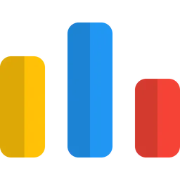

<h2 align="center">Hi ! I'm Dhruv Rankoti</h2>

###

AI Systems • Backend • Problem Solving

###

###

  

###

- 🧠 I’m currently learning System Design  
- 🤖 Build AI-powered systems (LLMs, RAG, NLP) with real-world use cases  
- 🧩 Strong foundation in Data Structures & Algorithms
- ⚙️ Focused on backend systems, APIs, and scalable architectures
- 💬 Ask me about my projects
- 📫 How to reach me: [dhruvrankoti@gmail.com](mailto:dhruvrankoti@gmail.com)

###

<h4 align="left">Languages & Tools:</h4>

###

  
  
  
  
  
  
  
  
  
  
  
  
  
  
  
  
  
  
  
  
  
  
  
  
  
  
  
  
  
  
  
  
  
  

###

<h4 align="left">Connect with me:</h4>

###

  
  
  
  
  

###

  
  
  
  
  

###

 
<picture>
  <source media="(prefers-color-scheme: dark)" srcset="https://raw.githubusercontent.com/Dhruv-Rankoti/Dhruv-Rankoti/output/github-snake-dark.svg" />
  <source media="(prefers-color-scheme: light)" srcset="https://raw.githubusercontent.com/Dhruv-Rankoti/Dhruv-Rankoti/output/github-snake.svg" />
  
</picture>

###

  <i>Building systems that work - not just projects that run.</i>

